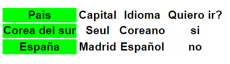

#Ana-apuntes-html
<style>
  table{
    background-color: 	#FFA07A;
  }
</style>

# Apuntes HTML
|Nombre | Significado |
|-------|-------------|
|doctype| le dice al navegador que usaremos la version 5 y sus atributos|
|\<html lang="es">|para especificar el idioma de la pagina. <br>si quiero que sea español mexico seria lang="es-MX", pero no es muy necesario.|
|\<head>|aqui va todo lo que el usuario no ve|
|\<meta charset="UTF-8">|UTF-8 seria como los caracteres universales, le dice al navegador que codifique el caracter del idioma que estoy usando, sobre todo en navegadores viejos.|
|\<meta name="viewport" content="width=device-width, initial-scale=1.0">|"viewport" es el area donde se visualiza el contenido y es MUY IMPORTANTE ponerla.|
|\<meta name="description" content="">| en el "content" va la descripcion y esta no debe ser mas de 165 caracteres IMPORTANTE NO PASARSE|
|\<title>titulo<\title>|este titulo debe ir entre 55 y 65 caracteres IMPORTANTE NO PASARSE|
|\<link rel="canonical" href="http://tudominio.com/la-url-canonica">|le dice a los motores de busqueda que esta es la url autentica y original.|
|\<link rel="icon" href="img/logo.png">|icono del title, se sugiere que entre mas grande la imagen mejor, el logo debe estar en png, el nombre normalmente es favicon.|
|\<link rel="apple-touch-icon" href="img/logo.png">|aqui va la de movil, puede ser la misma o una diferente, pero esta debe ser la de mayor calidad.|
|\<meta name="theme-color" content="#ff6600">|cambia el color de la barra de busqueda de arriba, esto se ve mejor en celulares.|
|\<body>|en el body va todo lo que el usuario ve.|
|\<aside>|https://developer.mozilla.org/es/docs/Web/HTML/Element/aside|
|\<figure>|https://developer.mozilla.org/es/docs/Web/HTML/Element/figure|
|\<table>|ejemplos de tablas aqui https://www.uv.es/jac/guia/tablaeje.htm|
|\<a>| https://developer.mozilla.org/es/docs/Web/HTML/Element/a|
|\<iframe>|hay algunas web que lo tienen en la parte de incorporar https://developer.mozilla.org/es/docs/Web/HTML/Element/iframe|
|\<small>|texto mas pequeño|
|\<strong>|cuando el texto es importante|
|\<em>| hace enfasis|
|\<blockquote>| se usa para citar y va con \<cite>|
|<abbr title="aqu va el texto">|cuando pasamos el mouse por encima, se ve ese texto|
|\<q>|para poner citas en linea|
|\<del>| representa un texto que se ha eliminado de un documento|
|\<address>|representa informacion de contacto|
|\<figure>|esta etiqueta contiene otras dentro, que pueden ser img, video tablas, etc|
|\<figcaption>|esta se usa para poner el pie de pagina de la imagen|
|download| si queremos que la persona descargue el recurso, pero debe estar en nuestro servidor|
|rel="nofollow"|sirve para que los bots o arañas sepan que es un enlace externo que no tiene mucho que ver con tu web. si si tiene que ver entonces no se usa ese rel|
|onclick="alert('texto de la alerta')"|con este atributo dentro de button podemos poner una alerta|
|controls|para que aparezca el audio|
|autoplay|para que se reproduzca al entra, no funciona en todos los navegadores. en movil tampoco por el tema de los permisos|
|loop|para que se reproduzca de nuevo al acabarse|
|mute|aparece el audio sin volumen|
|preload|cuando el navegador lo detecta aunque el usuario no lo reproduzca, se estara cargando para que no se corte por carga cuando el usuario le de click, USARLO SIEMPRE|
poster|este es de video y es la miniatura del mismo|
> Esas dos son importantes no pasarse porque nos sirve para el seo, la descripcion que aparece abajo del titulo de una pagina cuando la buscamos, es el meta description, poner diferente titulo y diferente descripcion en cada archivo html.

## Etiquetas para cards
|Nombre|
|------|
|\<meta property="og:title" content="Mis apuntes">|
|\<meta property="og:description" content="esta descripcion no debe ser mas de 165 caracteres">|
|\<meta property="og:image" content="https://midominio.com/img/crisitnayang.png">|
|\<meta property="og:url" content="https://midominio.com/sintaxis.html">|
|cards con lo basico de og, el resto lo puedo sacar de las redes sociales. <br>la ruta debe contener mi dominio|

## uso de figure
esta etiqueta nos ayuda a que cuando pasemos el mouse por encima de la imagen, aparezca el nombre

```html
<figure>
  
  <figcaption>An elephant at sunset</figcaption>
</figure>
```

## uso de la api para whatsapp

```html
<a href="https://api.whatsapp.com/send?phone=573214567032&text=Hola" target="_blank">Ir a WhatsApp</a>
```

en una url cuando esta este simbolo **_?_** significa que hasta ahi llego la url y podemos empezar a meter valores

## acordeon
~~~html

~~~

## Tipos de input

~~~html
  <h6>GENERAL O BASICO</h6>
    <input type="text" placeholder="text"><br> <!-- para texto -->
    <input type="password" placeholder="password"> <br> <!-- para contraseña -->
    <input type="search" name="" id="" placeholder="search"> <br> <!-- para busqueda -->
    <input type="url" name="" id="" placeholder="url"> <br> <!-- para url -->

  <h6>FECHA</h6>
    <input type="date" name="" id=""> <br>
    <input type="datetime-local" name="" id=""><br>
    <input type="month" name="" id=""> <br>
    <input type="time" name="" id=""> <br>
    <input type="week" name="" id=""> <br>

  <h6>ESTILO</h6>
    <input type="button" value="este es un boton"><br>
    <input type="hidden" name="idioma" value="es"> <br>
    <p>sirven para que cuando el formulario se envie, yo pueda devolver algun valor</p>

  <h6>SELECCION</h6>
    <input type="checkbox" name="" id="" value=""><br>
    <input type="radio"><br>
    <input type="radio" checked><br>
    <input type="color" name="" id=""> <br>
    <input type="file" multiple> <br>

  <h6>OBLIGATORIOS</h6>
    <input type="submit"> <br>
    <p>este envia los datos del formulario y el reset limpia todo</p>
    <input type="reset"> <br>

  <h6>DE CONTACTO</h6>
    <input type="email" name="" id="" placeholder="email"> <br>
    <input type="tel" placeholder="tel"> <br>
    <input type="number" placeholder="number"> <br>

  <h4>TEXTAREA</h4>
    <textarea name="" id="" cols="2" rows="3"></textarea>

  <h4>SELECT</h4>
    <select name="" id="">
      <option value="">Ana</option>
      <option value="">Cristina</option>
      <option value="">Silva</option>
    </select>
    <select name="" id="" multiple>
      <option value="">Ana</option>
      <option value="">Cristina</option>
      <option value="">Silva</option>
    </select>
  
  <input type="text" readonly value="no puedo modificar el texto" disabled> <br>
  <input type="text" placeholder="escribe aqui tu nombre"> <br>
~~~

|Nombres| Significado|Del type|de la etiqueta|
|-------|------------|:---------:|:----------:|
|checked|para fijar el mensaje o la opcion|radio
|multiple|si necesito seleccionar mas de un archivo|file
|step|de cuanto en cuanto|number
|min|minimo|number
|max|maximo|number
|rows| reenglones||textarea
|cols|caracteres a lo ancho||textarea
|\<select>|crea una lista de opciones donde podemos seleccionar una o varias opciones
|multiple|se pueden seleccionar varias opciones, usando ctrl||\<select>
|\<option>|cada opcion de la etiqueta select ira dentro de esta
|\<optgroup>| para ordenar las opciones por categorias, este debe ir con el atributo **label** para nombrar la categoria <br> es obligatorio el name y value|
|action|representa la direccion en donde llegara la informacion del formulario, incluso mailto sirve
|method|es el metodo de envio, hay GET y POST|
|get|no permite envio de ficheros adjuntos y los datos se envian visibles en la url|
|post|permite mas cantidad de informacion y datos adjuntos, los datos viajan ocultos|
|para ver los datos enviados usamos:|en inspeccionar, network, name, payload|
|name|categoria a la que pertenece|
|value|valor asociado al elemento asociado|


### ATRIBUTOS DE FORMULARIO
|Nombre|Significado|
|------|-----------|
|placeholder|pista de lo que el usuario puede introducir|
|required|hace que el campo sea obligatorio|
|readonly|hace que el campo sea solo de lectura|
|minlenght-maxlenght|minimo y maximo de caracteres de un campo de texto|
|selected|hace lo mismo que checked|
|disabled|desactiva el campo, no se podra escribir en ese campo, en el **value** se pone el texto que queremos mostrar|
|range|para un rango, se debe usar el **min** y el **max** con el, tambien el **step**|
|step| determina el numero por el cual el valor se puede incrementar o reducir|
|autocomplete|para que no aparezca el autocompletado en el campo|
|pattern|para que ingresen letras en un campo de text y numeros en uno de number|


## data atributtes
deben llevar la palabra **date-** y el nombre que queremos poner
```html
  <ul>
    <li data-id="1" data-name="spring">primavera</li>
    <li data-id="2" data-name="summer">verano</li>
    <li data-id="3" data-name="autumn">otoño</li>
    <li data-id="4" data-name="winter">inverno</li>
  </ul>
```

## Listas
|Nombre del atributo|Significado|lista ordenada|lista desordenada|
|-------------------|-----------|:--------------:|:-----------------:|
|start|para cambiar el orden de inicio|x|
|reversed|orden inverso|x|
|type|que tipo de numercion queremos|x|
|a continuacion atributos usando type=""|
|disc|este es el por defcto||x|
|square|cuadrado||x|
|circle|circulo||x|
|a continuacion para listas de definicion|
|dl|esta es la etiqueta para listas de definicion|
|dt|se usa para el termino|
|dd|se usa para la definicion|

## Tablas
|Nombre del atributo|Significado|
|-------------------|-----------|
|table|es la etiqueta de tablas|
|tr|para una fila|
|td|para una celda|
|para tablas agrupadas se usan las de abajo|
|thead|para la cabecera|
|tbody|cuerpo|
|tfoot|pie|
|sus atributos son|
|rowspan|para que una celda ocupe mas de una fila, el valor por defecto es 1|
|colspan|para que una celda ocupe mas de una columna, el valor por defecto es 1|

### Tabla con colgroup y col
~~~html
    <table>
      <colgroup>
        <col style="background-color: #0f0;">
        <col span="4">
      </colgroup>
      <tr>
        <th>Pais</th>
        <th>Capital</th>
        <th>Idioma</th>
        <th>Quiero ir?</th>
      </tr>
      <tr>
        <th>Corea del sur</th>
        <th>Seul</th>
        <th>Coreano</th>
        <th>si</th>
      </tr>
      <tr>
        <th>España</th>
        <th>Madrid</th>
        <th>Español</th>
        <th>no</th>
      </tr>
    </table>
~~~


